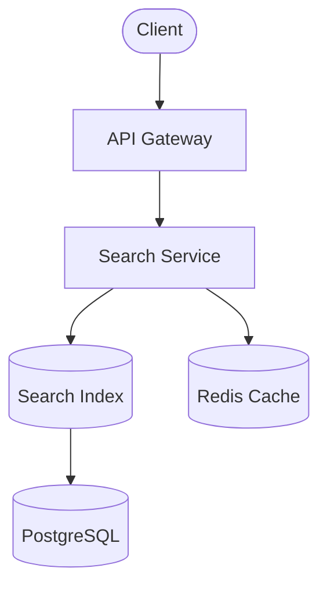
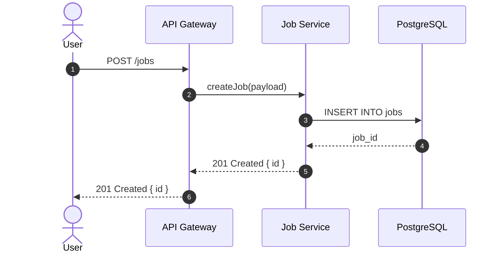
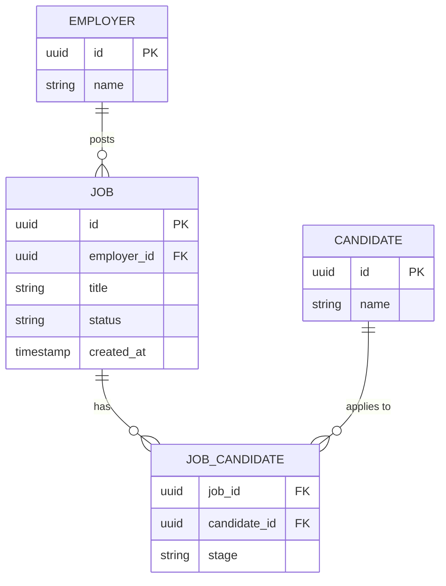

# Section Guidelines

Detailed writing instructions for each of the 9 proposal sections.
Reference this from Step 4 in [SKILL.md](SKILL.md).

---

## Section 1 — Title & Summary

- Write last, place first
- Action-oriented title (e.g. "Modernise Job Matching Engine", "AI Billing Slice 2 – Credit Limits & Alerts")
- 1–3 bullet summary: Problem (1 line) → Solution (1–2 lines) → Expected impact with numbers
- Avoid jargon in the first 3 bullets — add technical detail in later sections

## Section 2 — Problem & Context

- _Current state_: short description + 2–5 key constraint bullets
- _Pain points_: one clear pain per bullet with a metric where possible
  - Bad: "System is slow."
  - Better: "P95 response time is 2.4s vs target 800ms; causes drop-off in job views and recruiter complaints."
- _Why now_: deadlines, dependencies, opportunity cost, strategic alignment

## Section 3 — Objectives & Non-Goals

- 3–5 measurable objectives (e.g. "Reduce P95 latency from 2s → <800ms for /search endpoint")
- 3–5 explicit non-goals (e.g. "Does not redesign UI for job posting flow")

## Section 4 — Proposed Solution (Overview)

- _Approach_: 1–2 short paragraphs or 3–6 bullets — accessible to non-technical readers
- _Key components_: 3–7 bullets listing main components/changes
- _Rationale_: 3–5 bullets on why this direction vs obvious alternatives
- Keep deep implementation detail for Section 5 (Architecture)

## Section 5 — Architecture & Design Details

- _5.1 High-level architecture_: short text + Mermaid `flowchart` showing top-level components and their relationships
- _5.2 Core flows_: ALWAYS draw a Mermaid diagram for each primary flow — use `flowchart` for process/data flows, `sequenceDiagram` for request/response interactions
- _5.3 Data model_: ALWAYS draw a Mermaid `erDiagram` for any entity relationships, new tables, fields, or schema changes
- _5.4 Failure modes & recovery_: downtime, partial failure, data corruption handling
- _5.5 Tech decisions_: notable library, infra, or pattern choices — 2–3 bullet justification each

Embed Mermaid diagrams using the Confluence Mermaid macro:

```
{mermaid}
<mermaid content here>
{mermaid}
```

For code samples, use Confluence code blocks with the language specified:

```javascript
// complete, executable example — no placeholders
const result = await client.search({ query, limit: 50 });
console.log(result.hits); // Output: [{ id: '123', score: 0.98 }, ...]
```

## Section 6 — Impact

- _Business impact_: revenue, margin, conversion, retention, customer experience, operational efficiency
- _Technical impact_: reliability (error rate, MTTR), scalability, maintainability, tech debt reduction
- _Metrics table_: Metric | Current | Target — label estimates and state how you'll validate

## Section 7 — Risks, Trade-offs, Alternatives

- _Risks_: 3–10 items — Risk | Likelihood (L/M/H) | Impact (L/M/H) | Mitigation
- _Trade-offs_: 3–5 "We trade X for Y" bullets (e.g. "Higher infra cost for lower latency")
- _Alternatives_: each with 1–2 line description, pros, cons, why not selected
- Do not hide real risks — this section builds trust with reviewers

## Section 8 — Plan, Timeline, Resources

Phases:

- Phase 0 – Discovery / Spike
- Phase 1 – Core infra + happy path
- Phase 2 – Edge cases + hardening
- Phase 3 – Rollout & monitoring

Each phase: outcomes, key tasks, success criteria.

Timeline: weeks/sprints, not exact dates if uncertain; highlight critical dependencies.

Resources:

- _People_: roles + rough allocation (e.g. "2× BE, 1× FE, 0.5× DevOps for 2 sprints")
- _Tools/infra_: new services, licenses, storage, additional spend
- _Cross-team_: which teams involved and when

## Section 9 — Decision Required

- "We are asking for approval to:" + 2–5 clear action/commitment bullets
- If options: Option A (minimal/low-risk), Option B (full scope/higher impact), Option C (do nothing/baseline)

---

## Mermaid Diagram Guide

Always use Mermaid for flows and entity relationships. Embed with the Confluence `{mermaid}` macro.

### When to use each diagram type

| Section                       | Scenario                                    | Diagram type                     |
| ----------------------------- | ------------------------------------------- | -------------------------------- |
| 5.1 High-level architecture   | Component topology, service boundaries      | `flowchart TD` or `flowchart LR` |
| 5.2 Core flows — process      | Data transformation, pipeline, job steps    | `flowchart TD`                   |
| 5.2 Core flows — interactions | API calls, service-to-service, user actions | `sequenceDiagram`                |
| 5.3 Data model                | Tables, relationships, cardinality          | `erDiagram`                      |

### Flowchart (architecture overview or process flow)



**Node shapes** (per [Mermaid flowchart docs](https://mermaid.js.org/syntax/flowchart.html)):

| Shape      | Syntax      | Use for                      |
| ---------- | ----------- | ---------------------------- |
| Rectangle  | `[Label]`   | Service / component          |
| Stadium    | `([Label])` | External actor / entry point |
| Cylinder   | `[(Label)]` | Database / data store        |
| Rhombus    | `{Label}`   | Decision / branch            |
| Circle     | `((Label))` | Event / endpoint             |
| Hexagon    | `{{Label}}` | Process / transform          |
| Subroutine | `[[Label]]` | Subprocess / reusable block  |

**Link types:**

| Arrow            | Syntax            | Meaning                  |
| ---------------- | ----------------- | ------------------------ |
| Solid with head  | `A --> B`         | Standard directed flow   |
| Open / no arrow  | `A --- B`         | Association              |
| Dotted with head | `A -.-> B`        | Optional / async flow    |
| Thick with head  | `A ==> B`         | Critical / emphasis path |
| Labeled edge     | `A -- text --> B` | Annotated edge           |

**Direction:** `TD` / `TB` top-down (same; default), `LR` left-right (wide pipelines), `BT` bottom-up, `RL` right-left.

**Comments:** Use `%%` prefix — e.g. `%% This describes the diagram`.

### Sequence diagram (request/response or service interactions)



**Arrow types** (per [Mermaid sequence diagram docs](https://mermaid.js.org/syntax/sequenceDiagram.html)):

| Syntax | Line   | Arrow | Use for                          |
| ------ | ------ | ----- | -------------------------------- |
| `->>`  | Solid  | Head  | Synchronous call / request       |
| `-->>` | Dotted | Head  | Response / return value          |
| `->`   | Solid  | None  | Signal / one-way message         |
| `-->`  | Dotted | None  | Acknowledgement / weak response  |
| `-)`   | Solid  | Open  | Fire-and-forget / async dispatch |
| `--x`  | Dotted | Cross | Error / rejection                |

Add `autonumber` after `sequenceDiagram` to auto-number all messages.
Use `+` / `-` suffix on arrows to activate / deactivate lifebars: `A->>+B: call` / `B-->>-A: return`.

### ERD (entity relationship diagram)



**Cardinality notation** (per [Mermaid ERD docs](https://mermaid.js.org/syntax/entityRelationshipDiagram.html)):

| Left marker | Right marker | Meaning      |
| ----------- | ------------ | ------------ |
| `\|o`       | `o\|`        | Zero or one  |
| `\|\|`      | `\|\|`       | Exactly one  |
| `}o`        | `o{`         | Zero or more |
| `}\|`       | `\|{`        | One or more  |

**Relationship line:** `--` identifying (solid), `..` non-identifying (dashed).

Examples:

- `EMPLOYER ||--o{ JOB : "posts"` — one employer to zero-or-more jobs (identifying)
- `JOB }|..o{ TAG : "tagged"` — one-or-more jobs to zero-or-more tags (non-identifying)

### Diagram rules

- Every diagram MUST start with a `%%` title comment (e.g. `%% Job Application Flow`) or be preceded by a named heading
- Keep diagrams focused — one concept per diagram; split if it becomes too wide
- Use meaningful node labels, not abbreviations (e.g. `Job Service` not `JS`)
- Show only what changes or is relevant to the proposal — omit unaffected systems
- Use `%%` for any inline annotation or explanation within a diagram
